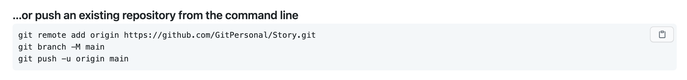
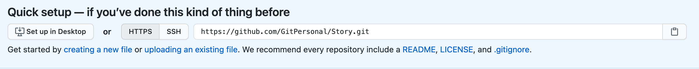
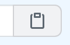

# **`Git`**

## `Initialize Git`

In terminal type `git init` in the directory you are currently working on.

a `.git` file will be created in the working directory and you won't be able to see it. You can see it by typing `-a` to see all the hidden files.

## `Track files`

To start tracking file changes you need to add the file to the `stagging area`

## `Git status`

To view what is in the `stagging area` type `git status`.

You will see all the untracked files in red. The file is still in the `working directory` and is not yet in the stagging area. 

## `Git add`

To start tracking files you need to type `git add {filename}` 

After doing `git add {filename}` type `git status` to see the change. 

The file added is now green.

## `Git commit`

Type `git commit -m "initial commit message"`

## `Git log`
You will now see the Author or person who made the commit and the time of the commit.

Adding new files to the stagging area. Type `git status` and you'll see the untracked files in red.

add these files by typing `git add {file name}` and add the next file by adding the `git add {filename}` of the next file. Or you can just type `git add .`
This will add all the files.

Now commit the two new files. `git commit -m "two new files"`

## Dealing with errors saved to file but not yet committed

Lets say I made some changes to my `chapter 3 txt file` and saved the file and closed it.

Type `git status` and see the file that hasn't been commited. It has been modified and it'll be in red text.

## `Git diff`

We can use a git command to see the differences between the current file and the last saved point in our git repository

To do that type `git diff {file name}`

The red is what was deleted or changes and the green is what was added.
## `Git checkout`

If you want to rollback to the previous version type `git checkout {file name}`

## `Git Hub`

Login to my `Github` account.

click on the `plus` sign to create a new repositoty.

Give it a `repository name` and a description

Select `Public`

Don't need to initialize this repository yet.

Click `Create repository`

--- 

We will use these two lines to push our code

`...or push an existing repository from the command line`

To push a repository I have locally, I'm going to use copy the `Quick setup` button.
This will allow me to push on to the remote depository

---

Jump back over to Terminal to make sure I'm in the `working directory`
and `git log` to see what previous commits we got. 

## `Git remote add origin {url}`

Do this when trying to push from local working repository to Github the first time so that you can push your code.

Now I want to commit all my transfers so to do that I type `git remote add origin {url of remote depository on github}`

## `Git push -u origin master`

To push my code the first time to the repo type `git push -u origin master`

This pushes the local repository to the remote repository using the `-u` flag or the `-u option` which links your remote and local repositories and then push it towards the `remote` called **`origin`** and the `branch` called **`master`**

`origin` is **`Name of Remote`** and `master` is **`Name of Branch`**

Master is the default branch or the main branch.

---

In Github you can click on `insights` and `network` to see the master branch.

Head back to the main page and select `<>Code` tab and click `commits` you can see the versions and if you click on it you can see the version of the changes of it.

    * git add

    * git commit -m "message for commit"

    * git pull

    * git push